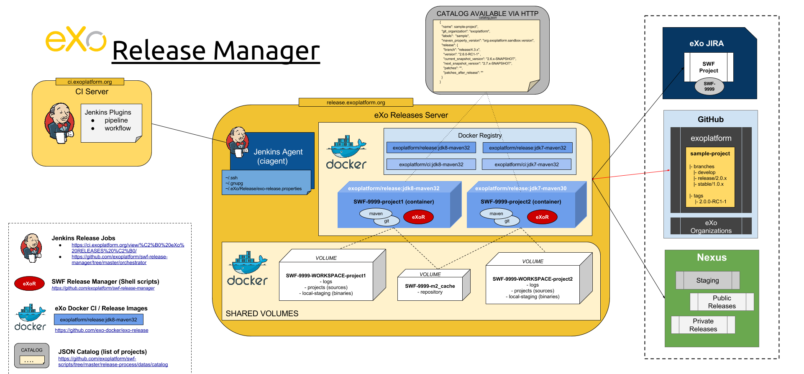

= eXo Release Manager

This repository contains all files about the eXo Release Manager:

* `*app*`: Scripts (bash) used in the *exoplatform/exo-release* Docker image, to release one project

[NOTE]
--
Those scripts are then included in the `eXo Release Docker Images` available at:

* https://github.com/exo-docker/exo-release
--
* `*doc*`: eXo Release Manager Documentation
* `*orchestrator*`: Groovy Scripts used by Jenkins to release/clean several projects with Docker Containers

== Overview

== Documentation

* <<doc/user-guide.adoc#,User Guide>>
